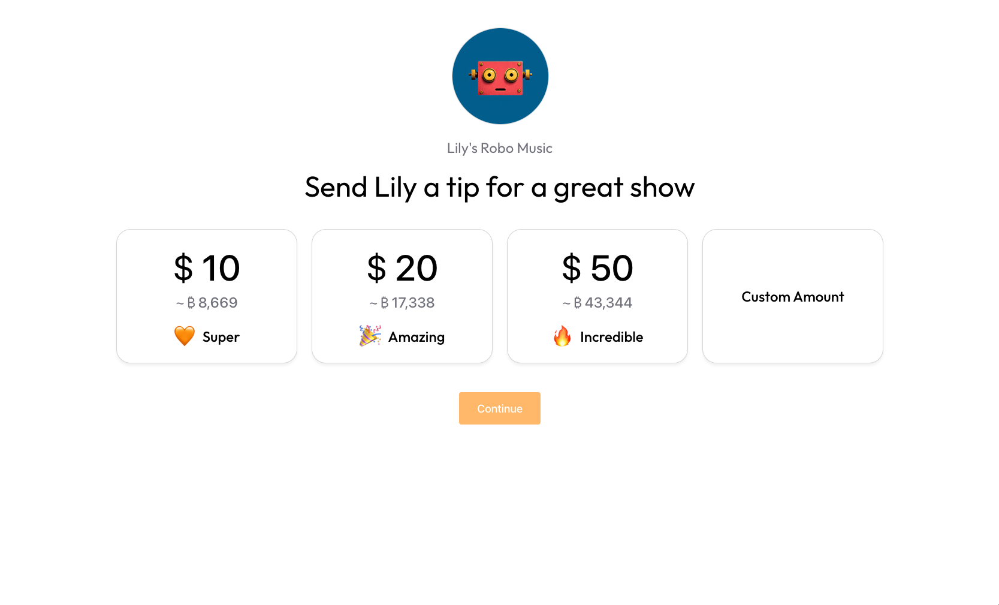

# Bitcoin Tip Jar



A tip jar built with the Bitcoin Builder Kit and [Voltage API](https://docs.voltageapi.com/).

## How It Works

This web app allows a user to accept tips in bitcoin. It offers some simple, predefined amount options, as well as a custom entry for the tipper to define a custom tipping amount. From there, it fetches a BOLT11 lightning invoice from the Voltage Payments API for the tipper to pay.

## Development Notes

### Bitcoin Builder Kit

This app uses the Bitcoin Builder Kit for it's UI system.

- [UI Package](https://www.npmjs.com/package/@sbddesign/bui-ui)
- [Tokens Package](https://www.npmjs.com/package/@sbddesign/bui-tokens)
- [Icons Package](https://www.npmjs.com/package/@sbddesign/bui-icons)

### Voltage

This app uses the Votlage Payments API to receive the bitcoin tips. Learn more about the Voltage Payments API here:

- [Voltage Payments API Docs](https://docs.voltageapi.com/)
- [Voltage Payments Scalar Docs](https://voltageapi.com/v1/docs)

### Environment variables

There are two environments in play:

- Development (Vite dev server)
- Production (Netlify + Netlify Functions)

To work consistently:

- In development, the frontend uses Vite env variables and a dev proxy. Define these in a `.env.local` file with the `VITE_` prefix.
- In production, the Netlify Function reads either non-prefixed or `VITE_`-prefixed variables so you can set whichever is convenient. The frontend does not require secrets in production.

Required variables:

- `VOLTAGE_API_KEY` or `VITE_VOLTAGE_API_KEY`
- `VOLTAGE_ORG_ID` or `VITE_VOLTAGE_ORG_ID`
- `VOLTAGE_ENV_ID` or `VITE_VOLTAGE_ENV_ID`
- `VOLTAGE_WALLET_ID` or `VITE_VOLTAGE_WALLET_ID`

Recommended setups:

- Development (`.env.local`): set only `VITE_*` variables.
- Netlify (Production): set either `VOLTAGE_*` or `VITE_VOLTAGE_*`. The function accepts both.

### How requests flow

- Development: frontend calls `'/api/voltage'` (Vite proxy) with `VITE_*` credentials.
- Production: frontend calls Netlify Function `'/api/voltage-payments'` for both POST (create) and GET (fetch by id). The function injects credentials from environment variables and never exposes them to the client.

### Netlify configuration

`netlify.toml` contains a redirect:

```toml
[[redirects]]
from = "/api/voltage-payments"
to = "/.netlify/functions/voltage-payments"
status = 200
```

No extra redirect is required for GET; it uses the same path with a query param `?id=...`.

### Local development (matching production)

Run Netlify Dev via pnpm so your frontend and the Netlify Function run together using the same paths as production:

```bash
pnpm dev
```

Notes:

- Ensure your local environment has `VOLTAGE_*` (or `VITE_VOLTAGE_*`) variables available to the function. You can use a `.env` file or Netlify CLI environment management.
- The frontend no longer needs `VITE_*` secrets for local dev when using `netlify dev`.
